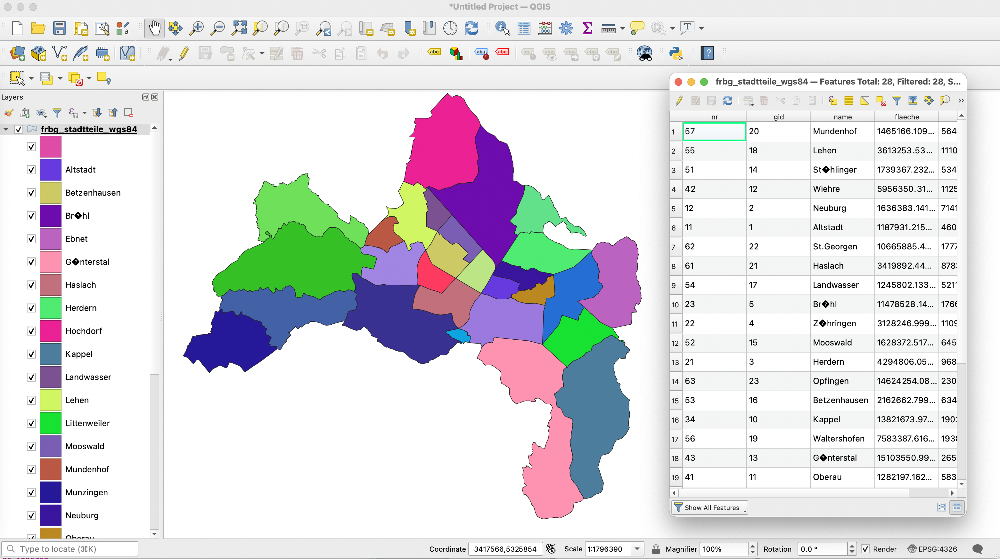
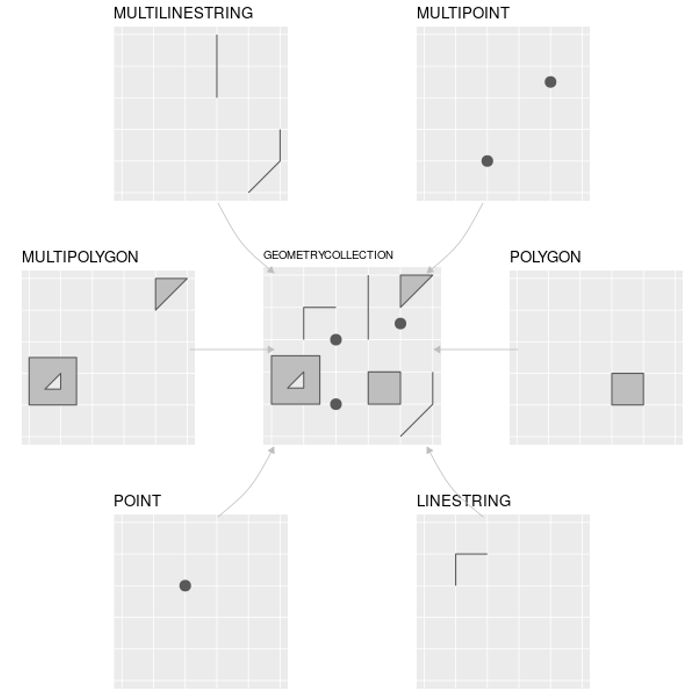
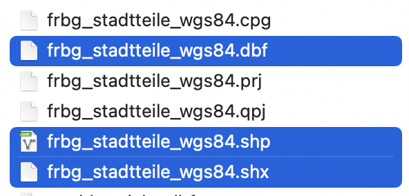
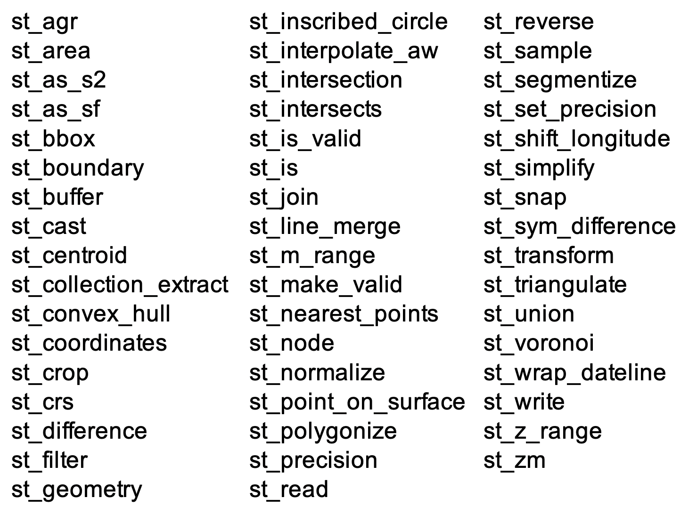
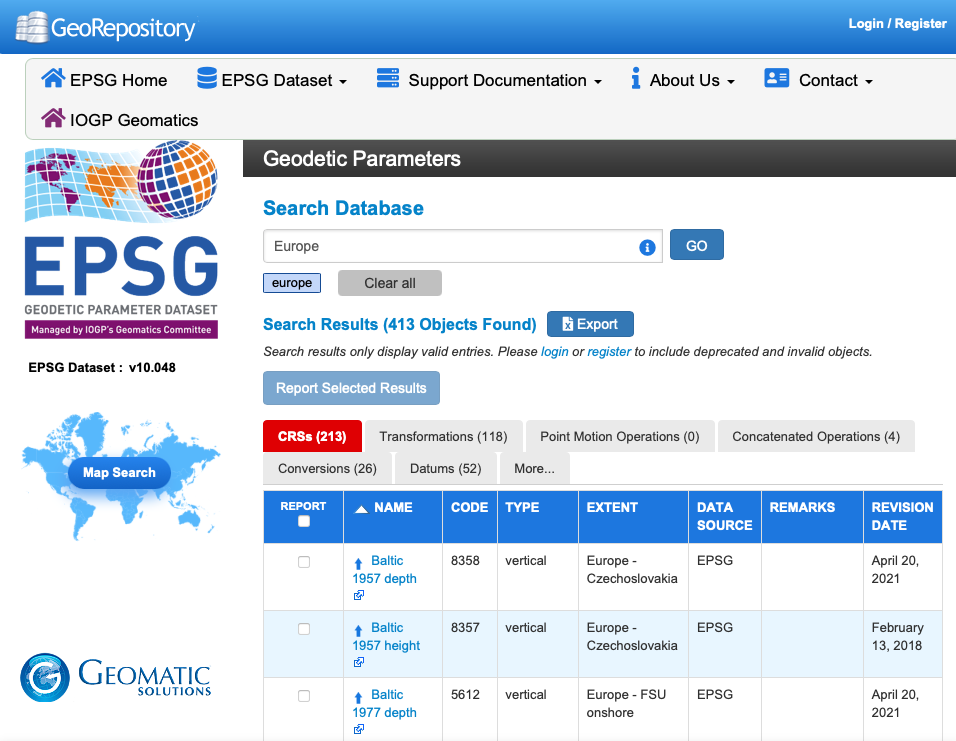
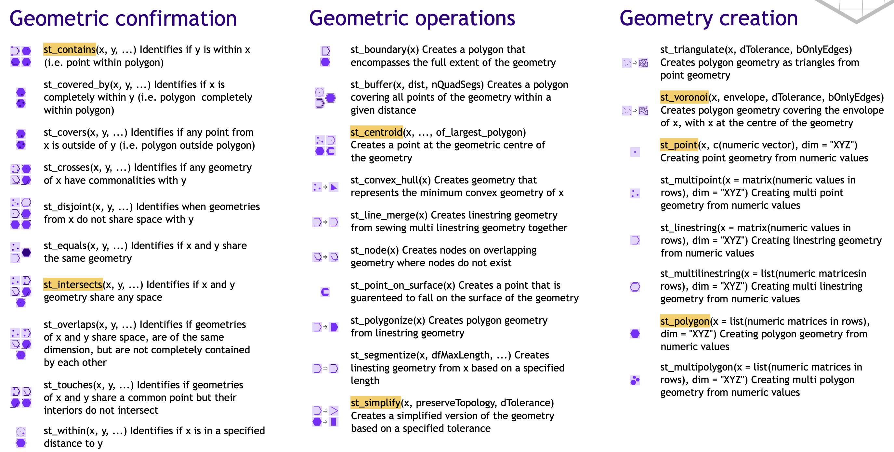

class: center, middle

background-image: url("intro_background.png")

# **Spatial Data in R**
## Introduction and sf package
### Michael Stölzle, University of Freiburg
#### January 2022

michael.stoelzle@hydro.uni-freiburg.de 

```{r setup, include=FALSE}
options(htmltools.dir.version = FALSE)
library(tidyverse)
```

---


# Comparison GUI-GIS and R-GIS

> <br> 
> Everything you have done with QGIS, you can also do with R.  
<br>


```{r, echo = FALSE}
df <- rio::import('/Users/modchemba/Dropbox/IHF/Lehre/MSc/_Datenkurs/Spatial_Data/table_comparison.xlsx')

xhtml <- knitr::kable(df, 'html')
kableExtra::kable_styling(xhtml, position = "left", font_size = 18)

```
<br><br>
**Basic Idea**: Output from a Data analysis is now coimbined with some spatial information. For example, you want to use HOBO sensor locations to estimate the average temperature per district in Freiburg.

---

```{r, echo=FALSE, out.width='98%', fig.align='center'}

```


---

# Learning steps during this lecture

 1. **Spatial data**: vector data, raster data
 
 2. Introduction to **sf package**
  - read/write vector data
  - types of vector data
  - combination of geometries and data
  - projection of spatial data
  - spatial data wrangling
 
 3. **Workflows** with spatial data
 
 4. **Interactive maps** for data exploration

---


# Comparison vector and raster data

```{r, echo = FALSE}
options(knitr.kable.NA = '')
df <- rio::import('/Users/modchemba/Dropbox/IHF/Lehre/MSc/_Datenkurs/Spatial_Data/table_vec_raster.xlsx')

xhtml <- knitr::kable(df, 'html')
kableExtra::kable_styling(xhtml, position = "left", font_size = 18)

```

### What is not covered by this lecture?

 * Processing raster data
 * Transfer between R and QGIS
 * ...


---

.pull-left[

# Raster-vector interactions

Examples from Book: Geocomputation with R

```{r, out.height=200, echo = FALSE}
knitr::include_graphics('https://geocompr.robinlovelace.net/06-raster-vector_files/figure-html/vector-rasterization2-1.png')
```

<br>
```{r, out.height=200, echo = FALSE}
knitr::include_graphics('https://geocompr.robinlovelace.net/06-raster-vector_files/figure-html/06-raster-vector-40-1.png')
```
]

.pull-right[
# Tasks

 * Extracting elevation zones from Digital Elevation Model?

 * Landuse classification in a catchment?
 
 * Counting measurements location in a given area?
 
 * Extracting elevation along a profile from A to B?
 
```{r, echo=FALSE}
knitr::include_graphics('https://geocompr.robinlovelace.net/06-raster-vector_files/figure-html/cropmask-1.png')
```

]

---
.pull-left[

# Loading sf package into R

```{r, fig.align='center', echo = FALSE, out.height= 150}
knitr::include_graphics("https://user-images.githubusercontent.com/520851/34887433-ce1d130e-f7c6-11e7-83fc-d60ad4fae6bd.gif")
```

 * sf means **Simple Features** for R
 * represents simple features as records in a `data.frame` or `tibble` with a geometry list-column

```{r, eval = FALSE}
#install.packages("sf")
#devtools::install_github("r-spatial/sf")

library(sf)
vignette('sf1')
```

]

.pull-right[

# Get help on sf

```{r, echo=FALSE, fig.align='center', eval=TRUE, out.height=300, out.width=300}

```

 * https://github.com/r-spatial/sf
 * R Cheatsheet: `sf`
 * R help `?sf`
 * Several R demos available
 * http://stackoverflow.com
 * Book: Geocomputation with R ([link](https://geocompr.robinlovelace.net))

]

---
.pull-left[

# Properties of sf package

 * open standard and modern architecture
 * including resources from `sp`, `rgeos`, `rgdal` (i.e. additional package installations might be needed)
 * fast `read`/`write` and good plotting performances
 * data is in `data.frames` or `tibble`, thus `sf` can often be 
 handled as data frame!
 * Fully pipe %>% compatible
 * st functions are intuitive, all starts with `st_`
 * Other packages support `sf`: 
   - `ggplot2`
   - `tmap` 
   - `mapview`
 * R community, good support, nice tutorials

]


.pull-right[
# Main features in sf

```{r, echo = FALSE, out.width=400}

```

]

---
# Application: Import ESRI shapefiles

.pull-left[
### File structure

* **.shp**   
The main file that stores the feature geometry; required.
* **.shx**  
The index file that stores the index of the feature geometry; required.
* **.dbf**  
The dBASE table that stores the attribute information of features; required.

others like .prj, .cpg, .qpj are optional
]

.pull-right[

### Example from explorer


```{r, fig.align='center', echo = FALSE, out.width=400}

```


]
---

# Read a shapefile into R


 * Sf is a responsive package (see console)
 
 * Mutiple drivers to read data (e.g. ESRI shp, csv, gml, geojson, osm, xlsx, sqlite)
 
 * Information on spatial data, features, projection
 
 * and 100% compatible to tidyverse and ggplot2
 
Question here: Is the `geometry` type as expected?

```{r, message=FALSE, warning=FALSE}
library(sf)
shp <- st_read('~/Desktop/freiburg_districts_shp/stadtteile.shp')
```


---


# sf object in R: A combination of geometries and data!

```{r, echo = FALSE}
shp <- shp %>% select(-umfang)
```


```{r}
shp
```
---

# sf: Classes and Data structure

.pull-left[
```{r}
class(shp) # a combination
attr(shp, "sf_column")
cbind(shp$name[1:5])
```
]

.pull-right[

```{r}
shp %>% st_drop_geometry %>% tibble()
```

]

---

# Understand sf-objects (1/2): Data structure

.pull-left[
```{r}
st_coordinates(shp) %>%  dim()
st_coordinates(shp) %>%  head(5)
names(shp)

```
]

.pull-right[

```{r}
as.data.frame(st_coordinates(shp)) %>%  
  count(L2, sort = TRUE) %>% slice (1:10)


```

]

---

# Understand sf-objects (2/2): Plotting

```{r, fig.height=5.5, warning=FALSE}

plot(st_geometry(shp), col = sf.colors(12, categorical = TRUE), 
     border = 'black', 
     axes = TRUE)
plot(st_geometry(st_centroid(shp)), pch = 4, col = 'red', add = TRUE)


```

---

# Processing sf geometries (like in tidyverse with %>%)

```{r}
shp %>% select(name, geometry) %>% 
        mutate(area = st_area(geometry)) %>% 
        mutate(area_km2 = as.numeric(area / 1e6)) %>% 
        mutate(category = if_else(area_km2 > 10, 'large', 'small')) %>% 
        slice(1:5)
```

```{r, eval=FALSE}
units::set_units(st_area(area), km^2) #convert with units!
```


---

# Available methods in the sf package

.pull-left[
```{r}
length(methods(class = "sf"))
```


```{r, eval = FALSE}
#show all methods in sf package
methods(class = "sf")
```
 * Read existing geometries
 * Geometric creation (e.g. transfer data.frame to geometry POINTS)
 * Geometric confirmation (e.g. is point element of polygon)
 * Geometric operations (e.g. crop, intersect, union)
 * Write geometries

]

.pull-right[

```{r, echo = FALSE}

```


]

---

# Create sf objects (1/2)

```{r}
data.frame(x=1:10, y = 31:40, data = runif(10)) %>% sf::st_as_sf(coords = c(1,2))
```


---

# Projections with CRS

```{r}
shp_prj <- shp %>% st_set_crs(31467) %>% st_transform(4326)
shp_prj
```

---
# Project shapefiles manually

```{r, eval = FALSE}

proj_longlat <- "+proj=tmerc +lat_0=0 +lon_0=9 +k=1 +x_0=3500000 +y_0=0 +ellps=bessel +datum=potsdam +units=m +no_defs"
proj_tmerc   <- "+proj=longlat +datum=WGS84 +ellps=WGS84 +towgs84=0,0,0"

GK_to_WGS84 <- function(RW, HW){
	WGS84 <- data.frame(cbind("X"=RW,"Y"=HW))
	coordinates(WGS84) <- c("X", "Y")
	proj4string(WGS84) <- CRS(proj_longlat)
	GK <- as.data.frame(spTransform(WGS84, CRS(proj_tmerc)))
	return(GK)
}

WGS_to_GK <- function(lat, lon){
	GK <- data.frame(cbind("X_GK"=lat,"Y_GK"=lon))
	coordinates(GK) <- c("X_GK", "Y_GK")
	proj4string(GK) <- CRS(proj_longlat)
	WGS84 <- as.data.frame(spTransform(GK, CRS(proj_tmerc)))
	return(WGS84)
}
```


---

# EPSG Code: Alternative to long projection proj-strings

.pull-left[
 
EPSG (European Petroleum Survey Group Geodesy)  

 * Coordinate Systems Worldwide
 
 * https://epsg.io or https://epsg.org/search
 
 * Code (4-5 digits) for a distinct identification of coordinate reference systems and projections
 
 * EPSG:4326 is WGS84 (used by Google etc.)
 * EPSG:31467  DHDN / Gauß-Krüger Zone 3	Area: Deutschland - von 7,5° East bis 10,5° East 

**Note**: To project your geometries to a specific coordinate system (i.e., EPSG-Code), you have to *know* your actual EPSG-Code AND this projection must be stored in the `sf` object!
]
.pull-right[
```{r, out.height=400, out.width=500, echo = FALSE}

```
]

---

# Spatial (data) manipulation with sf

```{r, out.height=800*0.59, out.width=800, echo=FALSE}

```

---

# Potential workflow

 1. Load shapefile with `st_read(file=...)`

 2. Check CRS and project geometries to other CRS
--

 3. Do calculations like in tidyverse
  * e.g. calculate `st_area`
  * `join` other `tibble` to `sf`-object

 4. `ggplot() + geom_sf()`
 
 5. Use `ggplot` syntax to fine-tune your map with themes, labels, legends, color maps etc.
 
 6. Export map as PNG or PDF file.
 
---


.pull-left[

### (1) Tibble with HOBO meta data ...

```{r, echo=TRUE, eval=TRUE}
pts <- tibble(
         hobo_id = c(1001, 1002, 1003),
         lon = c(7.75, 7.9, 7.817),
         lat = c(48.013, 47.94, 48.0215),
         exposition = c('N', 'W', 'E'))
pts
```


### (2) ...then transform and set CRS...

```{r, echo=TRUE, eval=TRUE}
pts2 <- pts %>% 
        sf::st_as_sf(coords = c(2,3)) %>% 
        st_set_crs(4326) %>% 
        st_transform(31467)
```
]

.pull-right[
```{r, echo=TRUE}
pts2
```


### (3) ... combine both in plotting

```{r, eval=FALSE}
ggplot() +
  geom_sf(data = shp) +# districts
  geom_sf(data = pts2) # HOBO locations
```

`geom_sf()` automatically uses the `geometry` column to plot polygons, points etc. CRS of `shp` and `pts` must match!
]

---

class: center, middle

## Result: ggplot2 map with two layers (polygon and points)

```{r, echo=FALSE}
ggplot() +
  geom_sf(data = shp, colour = "black") + # districts
  geom_sf(data = pts2, size = 5, aes(shape = exposition, 
          colour = exposition)) +
  theme_minimal(14) +
  ggtitle('HOBO locations in Freiburg')
```

---

# A interactive map for data exploration with leaflet()

```{r echo=FALSE, message=FALSE, warning=FALSE, out.width='85%'}
url <- 'https://docs.google.com/spreadsheets/d/e/2PACX-1vS_m42YZdulaKJVngJZq51T5CEX36LlqkAnHzOoVmcZXpbHGZ_AofTknbrPGRfWS5PRQ9GygOgkEHdz/pub?gid=2042487505&single=true&output=csv'
meta_data <- read_csv(url, skip = 1) %>% 
	     select(-contains('name')) %>% filter(region == 'Freiburg')

library(leaflet)

leaflet(meta_data) %>% 
	addTiles() %>% 
  #addProviderTiles(providers$Esri.NatGeoWorldMap) %>% 
	addMarkers(~longitude, ~latitude, label = ~as.character(hobo_id))
```

---

## tmap package: Static and interactive maps

.pull-left[
```{r, warning=FALSE, message=FALSE, eval = FALSE}
library(tmap)

tmap_mode("view")

tm_shape(pts2) +
  tm_dots(col = 'blue', size = .15) +
  tm_view(set.view = c(7.85, 48, 10)) +
  tm_basemap('Stamen.Terrain')
  
```

```{r, eval = FALSE}
#interactive mode
tmap_mode("view")

#static plot mode
tmap_mode("plot")
```
`tmap` is especially strong if you want to do thematic mapping - have a look on https://r-tmap.github.io/tmap/ and
Tennekes, M., 2018, *tmap: Thematic Maps in R*, Journal of Statistical Software, 84(6), 1-39.
]

.pull-right[
```{r, warning=FALSE, message=FALSE, echo=FALSE}
library(tmap)
tmap_mode("view")

  tm_shape(pts2) +
  tm_dots(col = 'blue', size = .15)+
  tm_basemap('Stamen.Terrain') +
  tm_view(set.view = c(7.85, 48, 11))
```


]


---

# Spatial data analysis with sf in R

Questions?